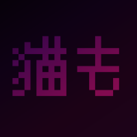

**A community-driven anime client built from the legacy Shiro and Kuro projects**

[Download](https://github.com/Nekomo-App/Nekomo/releases) · [Source Code](https://github.com/Nekomo-App/neko-source) · [Report an Issue](https://github.com/Nekomo-App/Nekomo/issues) · [Discord](https://discord.com/invite/E4Ezmgg7Ka) · [Website](https://nekomoapp.neocities.org/) · [GitHub](https://github.com/Nekomo-App)

> [!IMPORTANT]
> Please read the [DMCA & Legal Disclaimer](#-dmca--legal-disclaimer) before downloading, using, contributing to, or discussing Nekomo.

---

## ✨ About

Nekomo is an anime-focused Android and Android TV client, built in Kotlin, created from the ashes of the original **Kuro No** and **Shiro** projects.

- 🎌 AniList and MyAnimeList sync
- 📺 Anime streaming via third-party extractors
- ⬇️ Download support for offline viewing
- 📚 Library/watchlist with bookmarks and recently-watched tracking
- 📱🖥️ Phone and Android TV builds from one codebase
- 🔒 Optional DNS-over-HTTPS for the app's own API traffic

Not affiliated with or endorsed by AniList, MyAnimeList, Kitsu, TMDb, or any other third-party service.

> **Nekomo** — `猫も` (*Neko-mo*) — "cat too" in Japanese, also the sound of moving a shogi piece.

---

## 📥 Downloads

&nbsp;[Website](https://nekomoapp.neocities.org/) *(occasionally unavailable, work in progress)*

---

## 🌐 Socials

| | Link |
| --- | --- |
| 💬 Discord | [discord.com/invite/E4Ezmgg7Ka](https://discord.com/invite/E4Ezmgg7Ka) |
| 🐙 GitHub org | [Nekomo-App](https://github.com/Nekomo-App) |
| 📦 App releases | [Nekomo-App/Nekomo](https://github.com/Nekomo-App/Nekomo/releases) |
| 🧑‍💻 Source code | [Nekomo-App/neko-source](https://github.com/Nekomo-App/neko-source) |
| 🐛 Issues | [Report a bug](https://github.com/Nekomo-App/Nekomo/issues) |
| 🌍 Website | [nekomoapp.neocities.org](https://nekomoapp.neocities.org/) *(occasionally unavailable)* |

---

## 💬 Community

Join the [Discord](https://discord.com/invite/E4Ezmgg7Ka) to discuss anime, report bugs, request features, and keep up with the project's status.

Discord widget

 

---

## 🚧 Project Status

Nekomo is a community-maintained project, **not under active, guaranteed development**. It may receive updates, be rewritten, go inactive, be picked up by new contributors, or go private — but for now it also doubles as an anime community hub.

---

## 🤝 Contributing

Contributions are welcome — code, bug reports, docs, design, tutorials, testing. Use GitHub for code/issues and Discord for discussion and coordination.

<strong>Project guidelines, credits &amp; alternative apps</strong>

### Guidelines

- Keep the project low-key — please don't aggressively promote it outside the community.
- Currently rejected/unsupported: non-English localization, major UI redesigns, new names/logos, hentai content.

### Credits

Original Kuro contributors: [Deceptions](https://github.com/deceptions) (original developer), [LagradOst / Blatzar](https://github.com/LagradOst) (Cloudstream).

Built on prior work from [Kuro No](https://github.com/deceptions/no) ([backup](https://gitee.com/deceptionss/no)) and [Shiro App](https://github.com/MarshMeadow/shiro-app).

> [!CAUTION]
> The [original Kuro Discord](https://discord.gg/YgeFkTMmxh) may have been compromised or taken over — join at your own risk.

Archived downloads: [Kuro No Mobile 2.2.3](https://github.com/deceptions/no/releases/download/2.2.3/2.2.3.apk) · [Kuro No TV 2.2.3](https://github.com/deceptions/no/releases/download/2.2.3/2.2.3-TV.apk)

### Alternative apps

If Nekomo doesn't fit your needs: [Dantotsu](https://dantotsu.app/), [Cloudstream](https://github.com/recloudstream/cloudstream), Miru, [Anilab](https://anilab.to/). Also friends with Kitsune, AnimeTV, Kamyroll, and HDO PRO *(private)*.

---

## ⭐ Support

If you find Nekomo useful, a star on the repo helps show interest and encourages future development.

Star history

---

## ⚖️ DMCA & Legal Disclaimer

<strong>Click to expand — read before using, distributing, or contributing to Nekomo</strong>

- Nekomo is an open-source application and does **not** host, store, upload, distribute, or provide media content.
- Nekomo does **not** operate, maintain, own, or control streaming servers, content providers, media sources, or third-party services.
- Metadata, artwork, images, episode information, titles, descriptions, and other displayed information may come from third-party APIs or services.
- Nekomo is not affiliated with, endorsed by, sponsored by, or officially connected to AniList, MyAnimeList, Kitsu, TMDb, or any other content provider, company, service, or trademark owner unless explicitly stated.
- All trademarks, copyrights, logos, names, media, and other intellectual property belong to their respective owners.
- Users are solely responsible for how they use the software and must comply with all applicable local, national, and international laws.
- Developers, contributors, maintainers, and community members are not responsible for how third parties use the application.
- If you believe that content infringes your rights, contact the service, source, provider, or website hosting that content directly. Nekomo cannot remove content it does not host, own, control, or distribute.
- Do not upload Nekomo, Kuro No, Shiro, or any fork to the Google Play Store or another app store without ensuring compliance with that platform's terms and applicable law.
- By using Nekomo, you acknowledge that you use the software at your own discretion and risk.

---

**猫も — Nekomo — Cat too.**

